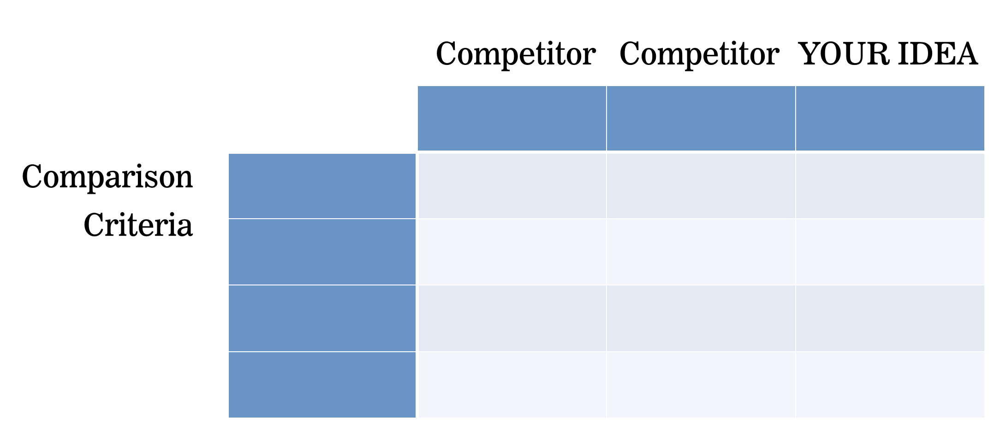

# User Research Lab

## I MUST HAVE:

1. Survey used
2. Responses to the survey (2)
3. A short pitch for your app

## What you need to do:

You'll need to conduct User research on a your chosen project 3 space:

1. Find a competitor or similar service to your project 3
2. Write at least 10 questions that could be used to analyze a competing product
3. Use those questions to interview at least 2 people (non-classmates) about your site
4. Write a quick summary/pitch (could be written, visual, mockup, etc) that describes - based on your research - what issues there are with your competitor, and how you can improve them.

## Bonus Points/Alternative Routes

1. Observe a user using a competing site
2. Create a competitive analysis grid
>

    
_What does that look like again?_

    

3. Compare more than one competitor
4. Interview more than 2 people

## Factors to consider in picking Users for testing

1. Internal/External - Personal history, mood, Location, relationships
2. Goals and tasks - what are they trying to accomplish?
3. Habits - What services to they commonly use? Are they part of your target demographic?
4. Access - how are they accessing your service? Device, OS, physical location, etc
5. When - Is there a certain time of day or location in which they use the service?

## User Interviews

1. Consider what you need to know about your subject, and start your questions there.
2. Prepare your questions ahead of time, but use it as a script, not a guide.
3. Ask about actual behavior, not intention
4. Avoid leading questions
5. Try to interview your users while they USE the service - you'll be able to make observations about how they use the app that can't be verbalized.

## Resources

- [3 Better Questions to Ask in User Interviews](https://medium.com/user-research/never-ask-what-they-want-3-better-questions-to-ask-in-user-interviews-aeddd2a2101e#.289y3afv0)
- [5 Steps to Create Good User Interview Questions](https://medium.com/interactive-mind/5-steps-to-create-good-user-interview-questions-by-metacole-a-comprehensive-guide-8a591b0e2162#.jb19n5mgi)
- [15 useful user feedback questions for online surveys](http://www.uxforthemasses.com/online-survey-questions/)
